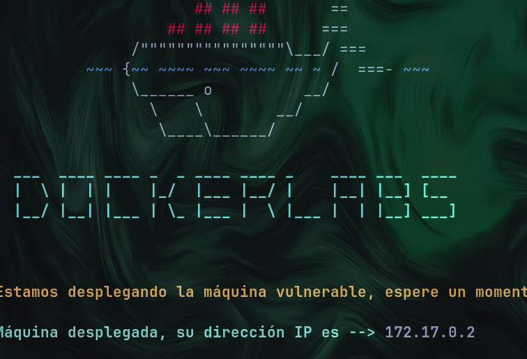

# Obsession

bueno esta es la ultima maquina de modo muy facil de dockerlabs , me gusto mucho&#x20;

encendemos la maquinita

<figure><figcaption></figcaption></figure>

realizamos nuestro escaneo con nmap a lo modo insano xd

<figure><figcaption></figcaption></figure>

y  vemos  que de primeras vemos dos archivos curiosos que estan en el servidor mediante ftp , y ensima nos dice que esta permitido el anonymous login , ajaja bueno entonces veamos que continenen , descarguenlo en su maquina local para que puean leerlo.

<figure><figcaption></figcaption></figure>

analizemos la web.

<figure><figcaption></figcaption></figure>

vale , vemos que es una web de couching o algo asi , para la gente mamada , entonces podriamos hacer una enumeracion de directorios aver que encontramos

<figure><figcaption></figcaption></figure>

wow la enumeracion con gobuster nos da unos directorios interesantes , ingresamos yvemos que es?..

<figure><figcaption></figcaption></figure>

wow en backup nos encontramos con esto , que torpe del ingeniero del website quien deja esto expuesto jaja , bueno ya tenemos un usuario al que hacerle fuerza bruta .

el otro directorio solo es un manifiesto hacker alguien lo habra dejado?...

<figure><figcaption></figcaption></figure>

en fin continuemos .

usamos el nombre russoski con hydra para ver si encontramos una contraseña

<figure><figcaption></figcaption></figure>

como vemos si encontramos es una contraseña estupida xd pero bueno , procedemos con la explotacion y escalada de privilegios.

<figure><figcaption></figcaption></figure>

vale bien ya ingresamos al servidor , vemos que el tal russoski tiene algo interesante en sus proyectos.. vemos que es&#x20;

<figure><figcaption></figcaption></figure>

al parecer es un script para crear contraseñas fuertes , bueno ya que estamos nos lo robamos xd&#x20;

<figure><figcaption></figcaption></figure>

una de las formas para hacerlo es con este comando scp , otra opcion mas facil es entrar por ftp y descargarlo xd pero meh mucha pasa mejor asi , ahora si volvamos a conectarmos al servidor para tener acceso completo.

<figure><figcaption></figcaption></figure>

vemos que tiene permitido usar vim como root , por lo que podemos ejecutar una shell con vim desde la one liner y asi es como somos root . ahora bien siguiendo el lore de la maquina debemos de encontrar un tal url de la conversacion que vimos el ftp.

<figure><figcaption></figcaption></figure>

y esto es lo que nos muestra : .png>)  xd
